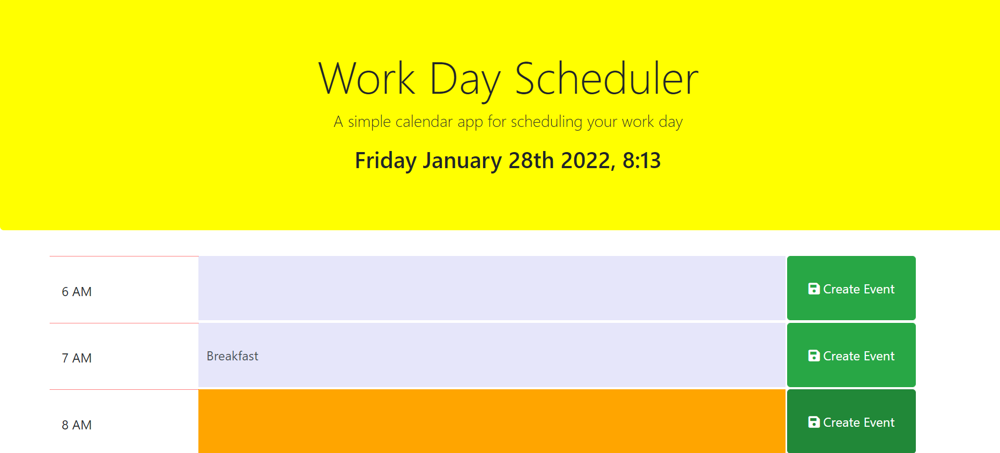
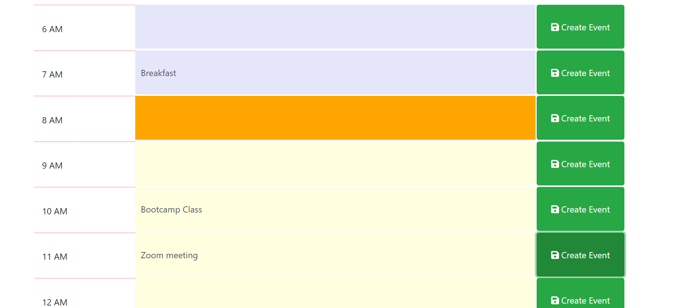

# DayPlanner
This day planner is created to schedule the events of a day from 6 AM to 6 PM. When we open the page current time and date is diplayed. Events can be created next to the time displayed below. Current event is displayed on Orange tab.
The following image shows the web application's appearance and functionality:

